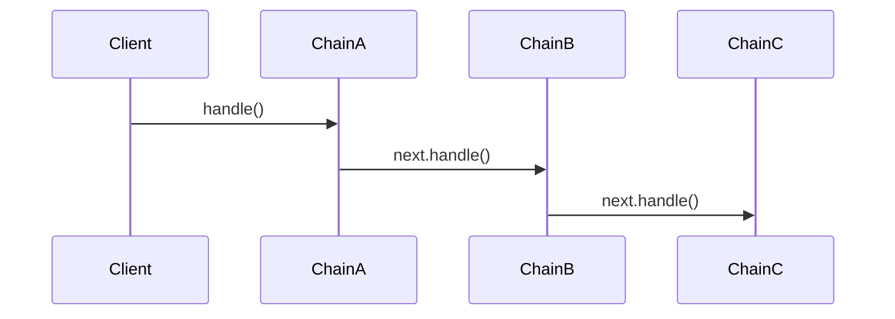

# Spring Chain Of Responsibility

[](https://github.com/evmetatron/spring-chain-of-responsibility/actions?query=workflow%3Abuild)
[](https://maven-badges.sml.io/sonatype-central/io.github.evmetatron/spring-chain-of-responsibility)
[](http://www.javadoc.io/doc/io.github.evmetatron/spring-chain-of-responsibility)

Library for building Chain of Responsibility in Spring applications
without manual wiring of dependencies.

Automatically links beans into a chain using `@Order` and `@ChainNext`.

## Chain Flow



## Features

- Automatic chain building via Spring context
- Supports `@Order` for execution order
- No manual wiring of chain dependencies
- Fully compatible with Spring AOP (proxies supported)
- Last class of chain contains Proxy implementation on chain interface when the class has field with `@ChainNext`

## How it works

- All beans implementing the chain interface are collected from the Spring context
- Beans are sorted using `@Order`
- The next element is injected via `@ChainNext`

## Add dependency

### Add library in pom

<!-- version:start -->
```xml
<dependency>
    <groupId>io.github.evmetatron</groupId>
    <artifactId>spring-chain-of-responsibility</artifactId>
    <version>0.1.0</version>
</dependency>
```
<!-- version:end -->

### Add library in gradle

<!-- version:start -->
```gradle
dependencies {
    implementation("io.github.evmetatron:spring-chain-of-responsibility:0.1.0")
}
```
<!-- version:end -->

## Create bean by chain interface

```java
import io.github.evmetatron.spring.cor.ChainFactory;
import org.springframework.context.annotation.Bean;

@Bean
public ChainInterface chain(@Autowired ChainFactory chainFactory) {
    return chainFactory.createChain(ChainInterface.class);
}
```

## Create interface and classes

### @ChainNext

Injects the next element in the chain.

The order is defined using `@Order`.

### Important

- Do not forget `@Component` or `@Service`
- `@Order` defines execution order

```java
import io.github.evmetatron.spring.cor.ChainNext;
import org.springframework.core.annotation.Order;
import org.springframework.stereotype.Component;

public interface ChainInterface {
    void handle();
}

@Component // or @Service
@Order(1)
public class ChainA implements ChainInterface {
    @ChainNext
    private ChainInterface next;

    @Override
    public void handle() {
        /* Some code */
        System.out.println("Chain A");
        
        if (shouldContinue()) {
            next.handle();
        }
    }
}

@Component
@Order(2)
public class ChainB implements ChainInterface {
    @ChainNext
    private ChainInterface next;

    @Override
    public void handle() {
        /* Some code */
        System.out.println("Chain B");

        if (shouldContinue()) {
            next.handle();
        }
    }
}
```

### Call chains

```java
import org.springframework.beans.factory.annotation.Autowired;
import org.springframework.stereotype.Component;

@Component
public class ExampleClass {
    @Autowired
    private ChainInterface chain;

    public void execute() {
        chain.handle(); // call all chains
        
        // Result:
        // Chain A
        // Chain B
    }
}
```